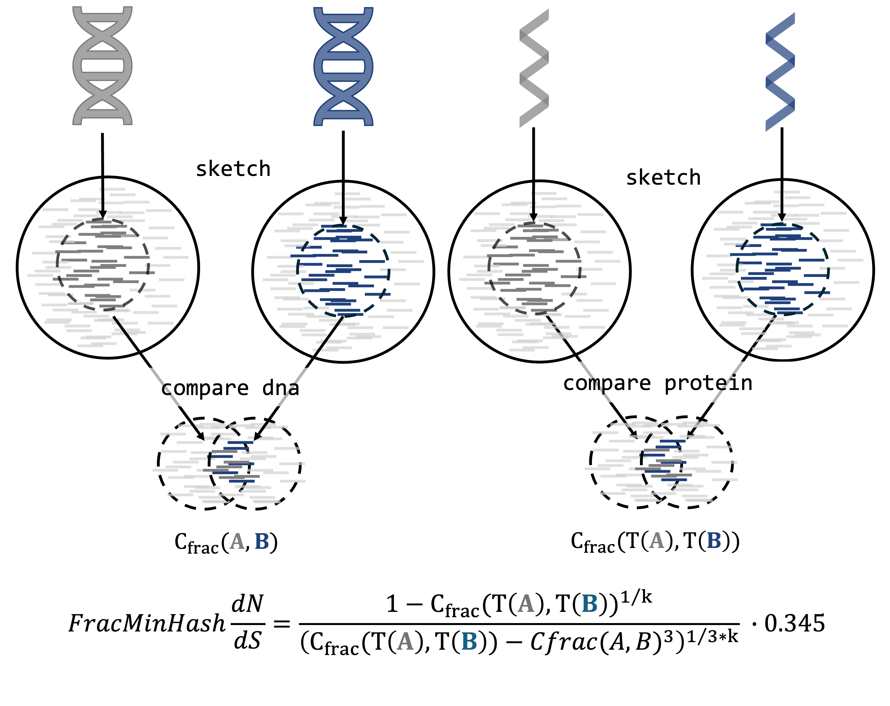

# FracMinHash d<sub>N</sub>/d<sub>S</sub>: an alignment-free measure of selection pressures for metagenomic samples 

## Summary

Traditional d<sub>N</sub>/d<sub>S</sub> models infer selection pressues of protein-coding genes by estimating the rates of nonsynonymous substitutions to synonymous ones using sequence alignments. However, as sequencing becomes more accessible and data volumes grow, alignment-free methods are gaining traction. Therefore, we developed an alignment-free d<sub>N</sub>/d<sub>S</sub> estimator to apply on pairwise analyses of longer sequences such as genomes. 

The FracMinHash containment index has been linked to the simple mutation model, enabling alignment-free estimation of average nucleotide identity (ANI) and mutation rates between genomes. This framework has been extended to protein sequences via average amino acid identity (AAI), allowing joint estimation of d<sub>N</sub>/d<sub>S</sub> ratios for genomic selection pressures.

In short, by sketching genomes with FracMinHash and comparing containments, evolutionary metrics such as d<sub>N</sub>/d<sub>S</sub> can be inferred without sequence alignments. 

## FracMinHash d<sub>N</sub>/d<sub>S</sub> Workflow

In the intitial steps of estimating FracMinHash d<sub>N</sub>/d<sub>S</sub>, sourmash is used to sketch genomic datasets and conduct pairwise comparisons, producing FracMinHash containment indices required for estimating FracMinHash d<sub>N</sub>/d<sub>S</sub>.

After generating these sketches, the pairwise containment indices for both DNA and protein sequences are calculated individually. 

Finally, these containment indices are utilized within Python scripts to estimate FracMinHash-based d<sub>N</sub>/d<sub>S</sub>.



## Executing FracMinHash d<sub>N</sub>/d<sub>S</sub> 

The script utilizes the following required parameters.

  | Parameter         | Explanation                                                  |
  | ----------------- | ------------------------------------------------------------ |
  | fasta_input_list  |  Input csv file that contains fasta files for sketching. This csv file follows sourmash scripts example, where in the first column is name, second column is dna fasta filename, and third column is protein fasta filename. |
  | scaled_input      | Identify a scaled factor for signature sketches. Default: 500. Use a scale factor of at least 10 for thousands of genomes. |
  | ksize             | Length of k-mer. This is the k-mer size for the amino acid (i.e., kaa). The program obtains the k-size of the nucleotide sequencing by calculating 3*kaa. Default is 7.|
  | directory         | Output directory for estimations. |
  | cores             | Total core usage (default: 100, ideal when using thousands of genomes)   |
  | threshold         | Set containment threshold (default: 0.05, used in sourmash plugin branchwater commands) |

To execute, use the following commad: 

```python3 fmh_dnds.py --fasta_input_list datasets.csv --directory . ```


<!--
FRACdNdS is a scalable dN/dS estimator for genomes that leverages the sketching approach FracMinHash.

FRACdNdS estimates dN/dS at a genomic level by deriving the containment indexes for between two genomes at a nucleotide and protein level. In practice, the dN/dS ratio infers selection pressues of protein-coding genes by estimating the rates of nonsynonymous substitutions to synonymous ones. We developed a dN/dS estimator to apply on pairwise analyses of longer sequences such as genomes. Currently, FRACdNdS is applied on a FASTA files and has two modes of execution: (1) "sngl" for using a single FASTA with multiple genome entries and (2) "bwpair" for using multiple individual FASTA files, where each FASTA file contains the gene sequences of one genome. 

For detailed usage and installation instructions please visit: coming soon.


Citing FRACdNdS

Please cite: coming soon.

# Requirements

FRACdNdS >= v is written in python3 and requires the following dependencies:

- X
- Y
- Z

# Installation

## Conda environment

under construction

```
# Create the conda ennvironment
conda create -n fracdnds

# Activate the conda environment
conda activate fracdnds

# Download and install dependencies
conda install -c bioconda -c conda-forge XYZ

# Clone the github directory
git clone XYZ
cd FRACdNdS
python setup.py install
```

# Quick start

demo coming soon

To run, simply invoke the `nohup bash run_fmh_omega.sh > log 2>&1 &` script. Other scripts are supporting scripts.

If you need memory information, invoke `nohup /usr/bin/time -v bash run_fmh_omega.sh > log 2>&1 &`

# Usage 

## Overview

## Workflow

>
